# drift_viterbi metrics

`bench/dv_metrics.c` measures the decoding-mistake rate as a function of the
channel's flip / insert / delete / erase rates, for all four standard codes. It
runs a Monte-Carlo sweep — random message → encode → channel → stream-decode —
and reports the **normalized edit (Levenshtein) distance** between the decoded
bits and the original message, divided by the number of message bits (after a
warm-up to skip the acquisition transient). Each axis is swept independently with
the other rates at zero, so each curve isolates one impairment.

> Edit distance is the right metric for a channel that inserts and deletes bits:
> a single uncorrected sync slip costs *one* edit, rather than misaligning the
> whole remaining stream the way a position-by-position bit comparison would. A
> clean decode scores 0; total failure approaches ~1 edit per info bit.

```sh
# Build the harness (off by default) and run the sweep to CSV.
cmake -S . -B build -DDRIFT_VITERBI_BUILD_BENCH=ON
cmake --build build --target dv_metrics
build/bench/dv_metrics > metrics.csv          # defaults: 12 trials, 4000 info bits
# build/bench/dv_metrics <trials> <info_bits> <seed>   # e.g. 3 1000 1 for a quick run

# Plot the mistake metric vs each channel rate (one curve per code). Needs matplotlib:
python3 -m venv .venv && .venv/bin/pip install matplotlib
.venv/bin/python bench/plot_metrics.py metrics.csv -o plots/
```

The default sweep takes a few minutes (the drift-tracking axes dominate); pass
smaller `trials`/`info_bits` for a faster, coarser run. The sweep is fanned out
across cores with OpenMP when available, and each point owns a seeded PRNG
stream, so a given `seed` reproduces exactly regardless of thread count.

By default the plotter writes, per axis, two metrics × two units —
`plots/{edit,runlen}_vs_{flip,insert,delete,erase}_per_{info,coded}_bit.png`:

- **edit** — edit distance per bit (mistakes per bit).
- **runlen** — mean run length between edits (`1 / edit_rate`): the average bits
  that get through between mistakes, i.e. how long a transmission you can expect
  to push through cleanly. Points where no edits were observed are dropped (the
  value there is only a lower bound, not infinity).

Since the channel rate (x-axis) is per coded bit, the per-coded-bit view divides
by the code's rate `n` so codes of different rates compare fairly. Run-length
plots are linear with an adaptive y-cap (the low-rate spikes run off the top);
pass `--logy` for a log axis or `--ymax N` to set the cap. Pass
`--metric edit|runlength` or `--unit info|coded` to emit just one.

## Generated plots

The figures below come from a 30-trial × 4000-info-bit sweep (`dv_metrics 30
4000`, default seed). In every plot the x-axis is the channel impairment rate
per coded bit, and the four curves are the standard codes — `K3_R1_2`, `K7_R1_2`
(rate 1/2), `K7_R1_3` (rate 1/3) and `K5_R1_5` (rate 1/5), in order of increasing
redundancy. Flip, insert, and delete are swept to 20%; erasures are far more
correctable, so that axis is swept to 80%. Each channel axis has two metrics
(edit distance, run length between edits) in two units (per info bit, per coded
bit).

### Flip channel (bit substitutions)

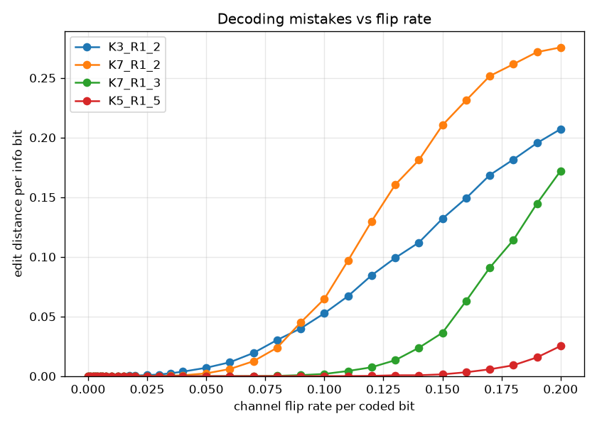

Edit distance per info bit. Every code holds at zero up to a threshold, then
climbs, and tolerance scales with redundancy: `K5_R1_5` barely reaches 0.02 even
at 20% flips, `K7_R1_3` turns up around 10%, and the two rate-1/2 codes turn up
near 6–8% (`K7_R1_2` degrades fastest past its knee, ending highest at ~0.28).

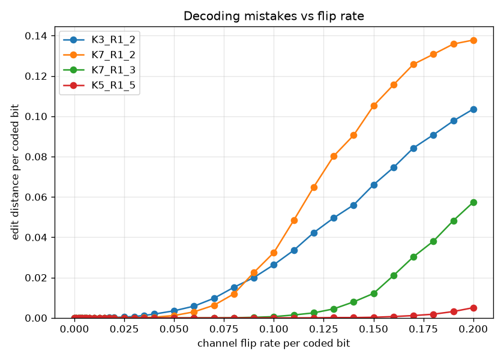

The same data per coded bit (each curve ÷ its rate `n`) — the fair cross-code
comparison, since the x-axis is per coded bit. The ranking is unchanged but the
gaps widen: `K5_R1_5` stays under 0.005 while `K7_R1_2` reaches ~0.14.

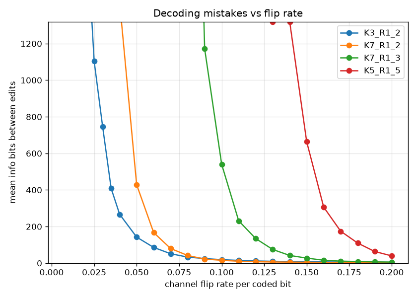

Mean run length between edits, in info bits (linear, adaptive y-cap ~1320). Each
code's run length is effectively unbounded (off the top) below its threshold,
then drops off a cliff: `K3_R1_2` near 2.5%, `K7_R1_2` near 5%, `K7_R1_3` near
10%, `K5_R1_5` near 15%. This reads directly as "how long a clean run you can
expect" at a given flip rate.

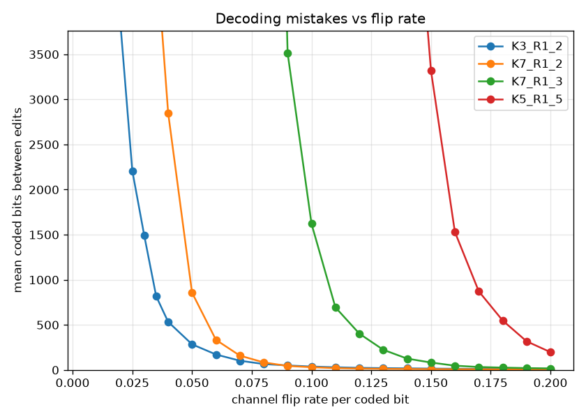

The same in coded bits (`n`× larger, cap ~3760); identical cliff positions. Use
this view when you care about bits on the wire rather than payload delivered.

### Insert channel (spurious bits)

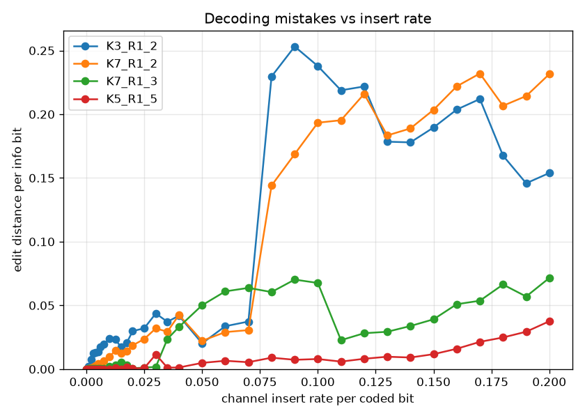

Edit distance per info bit. With the bit-level-alignment decoder the codes now
separate cleanly by redundancy: `K5_R1_5` stays under ~0.04 even at 20%
insertions and `K7_R1_3` under ~0.07, while the rate-1/2 codes hold low until
~7% then jump to ~0.18–0.25 (jagged — the regime where they lose lock is
high-variance). Extra parity clearly buys indel tolerance now.

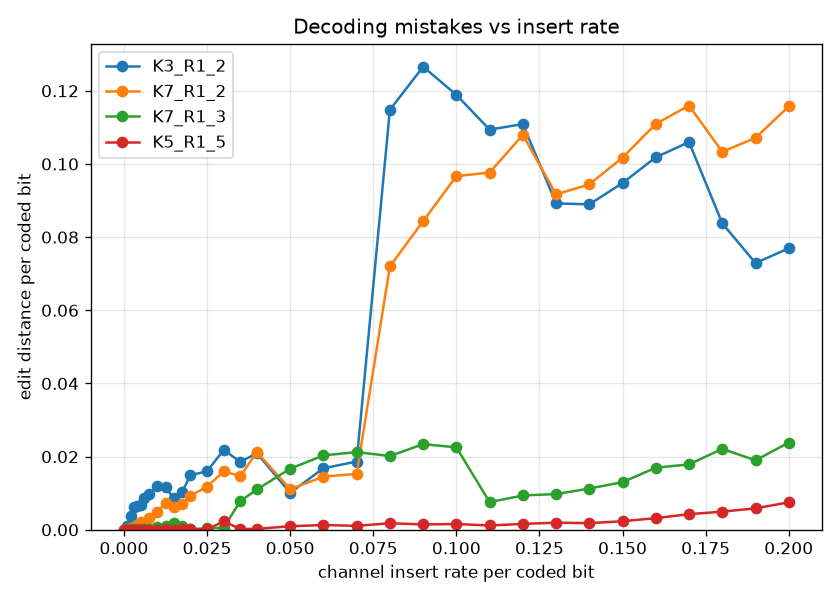

Per coded bit the separation is starker: `K5_R1_5` stays below ~0.01 across the
whole range, `K7_R1_3` ~0.02, and the rate-1/2 codes reach ~0.08–0.12.

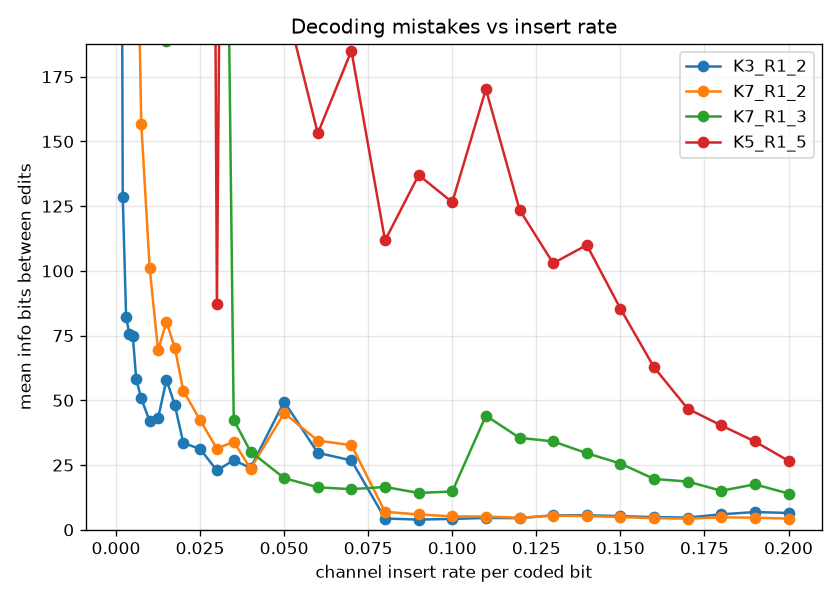

Run length in info bits (cap ~190). `K5_R1_5` sustains ~100–190 info bits per
edit across most of the range (spiky, since edits are rare), `K7_R1_3` ~20–50,
while the rate-1/2 codes collapse below ~10 once they lose lock past ~7%.

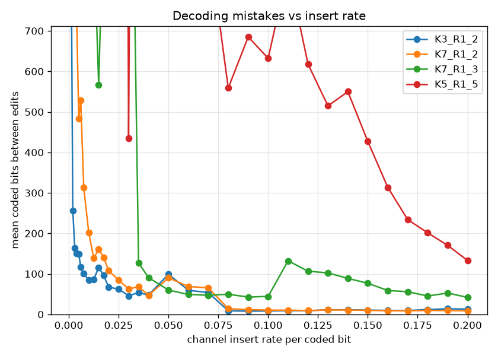

The same in coded bits (cap ~710): `K5_R1_5` clears many hundreds of coded bits
per edit, while the rate-1/2 codes manage only a handful past their knee.

### Delete channel (dropped bits)

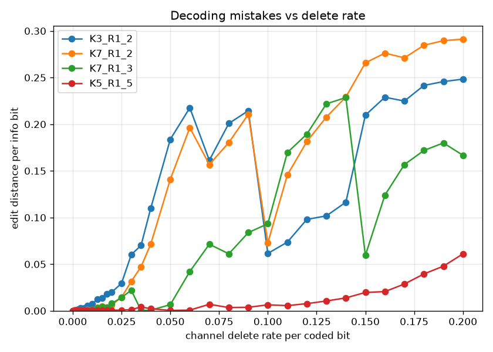

Edit distance per info bit. Deletions now separate by redundancy too: `K5_R1_5`
only reaches ~0.06 at 20% deletions and `K7_R1_3` stays well below the rate-1/2
codes, which climb to ~0.25–0.29. The curves are non-monotonic in the failure
regime (e.g. dips near 10–15%) where partial re-sync comes and goes. The knee is
earlier than for flips — a dropped coded bit also shifts timing.

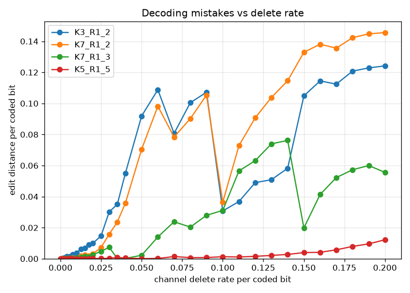

Per coded bit, a clean redundancy ranking: `K5_R1_5` ~0.012, `K7_R1_3` ~0.055,
and the rate-1/2 codes ~0.13–0.15 at 20%.

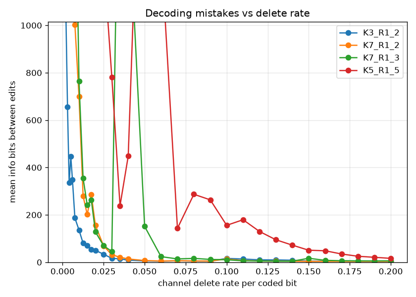

Run length in info bits (cap ~1020). `K5_R1_5` holds an effectively unbounded run
out to ~3% deletions and stays the highest throughout; the rate-1/2 codes cliff
earliest. Tails settle at tens of info bits per edit.

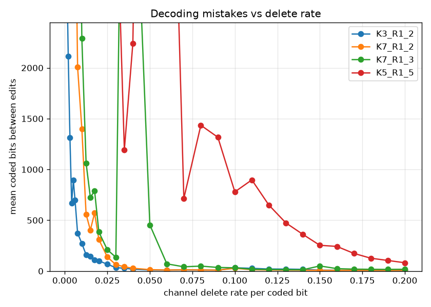

The same in coded bits (cap ~2450), scaled by rate; same ordering.

### Erase channel (bits marked lost)

Erasures carry no wrong information — the decoder knows which symbols are
unknown — so the codes tolerate far higher erasure rates than flips or indels,
each failing only as the erasure rate nears its `1 - rate` capacity limit. Note
the wider x-axis (to 80%).

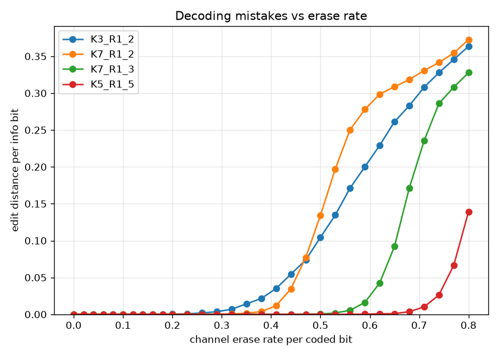

Edit distance per info bit — clean S-curves with knees at the capacity limits.
The rate-1/2 codes (`K3_R1_2`, `K7_R1_2`) turn up around 45% (`K7_R1_2` a touch
earlier and steeper), `K7_R1_3` (rate 1/3) around 60%, and `K5_R1_5` (rate 1/5)
only past ~72%. Every code rides out 20% erasures at essentially zero edits.

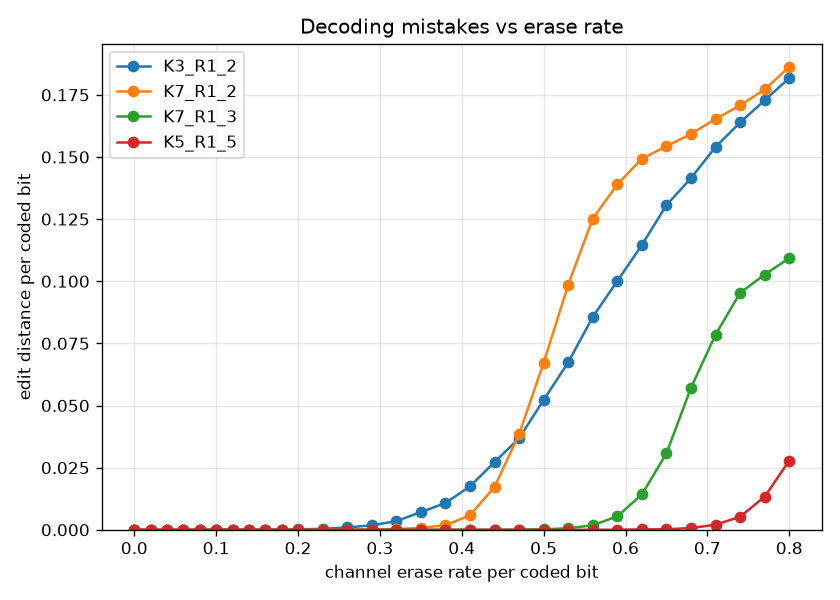

Per coded bit, the same knees with curves scaled by rate: `K5_R1_5` stays under
0.03 even at 80% erasures, while the rate-1/2 codes reach ~0.18.

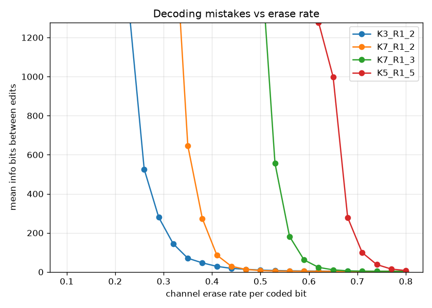

Mean run length between edits, info bits (cap ~1280). Each code holds an
effectively unbounded run until its capacity limit, then drops off a cliff; the
cliffs march rightward with redundancy (rate-1/2 near 45%, `K7_R1_3` near 60%,
`K5_R1_5` near 75%).

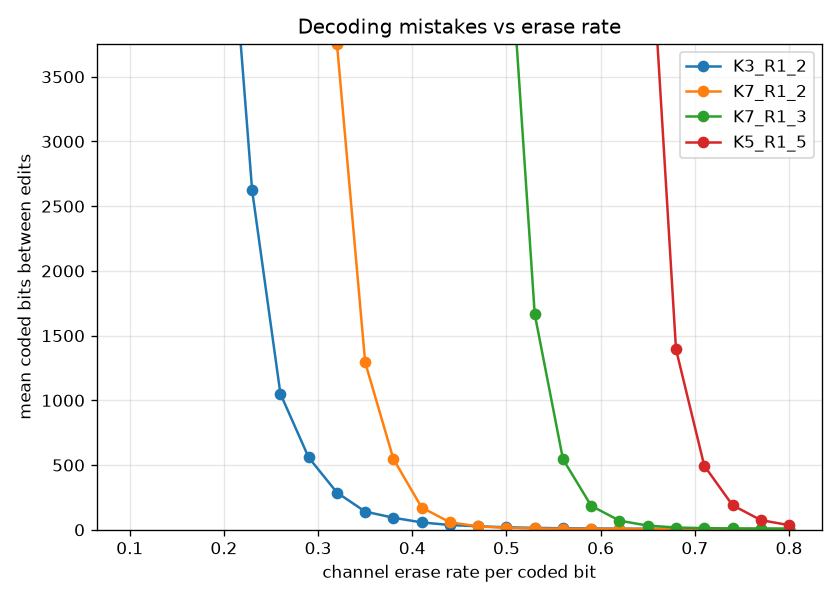

The same in coded bits (cap ~3760); identical cliff positions, scaled by rate.
